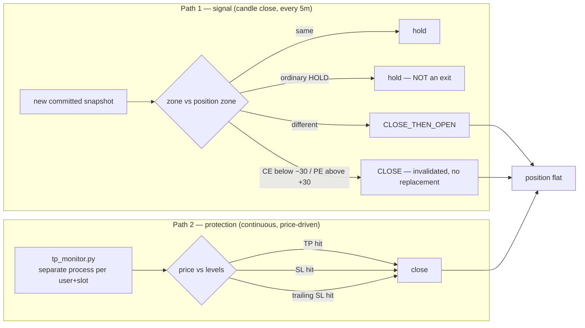

# Trade lifecycle — score to order to exit (2026-07-26 zone spec)

Both **Paper (DRY RUN)** and **Real (LIVE)** run the *same* decision path and
the *same* score source. The only differences are which namespace state is
written to and whether an order actually reaches the venue.

## Decision flow

```mermaid
flowchart TD
    A["_trend_auto_loop<br/>every 15s"] --> B{"TREND_SCORE_AUTO_MODE"}
    B -->|disabled| Z1["stop: no cycle"]
    B -->|dry_run| C["_maybe_auto_trend_score_cycle<br/>PAPER namespace"]
    B -->|live| D["_maybe_auto_trend_score_live_cycle<br/>LIVE namespace"]

    C --> E["_collect_trend_score_auto_signal()"]
    D --> E

    E --> F["trend_engine_client.get_snapshot()<br/>GET :5055/trend/latest"]
    F --> G{"data_quality == OK ?"}
    G -->|"no — unreachable / stale /<br/>schema or clock mismatch"| Z2["RAISE — fail closed<br/>(score 0.0 would be SHORT_MOVE,<br/>so an outage must not fall through)"]
    G -->|yes| H["score = snapshot.trend_score<br/>zone  = snapshot.zone"]

    H --> J["plan_score_transition&#40;score, signal_key&#41;"]

    J --> K{"signal_key already consumed?"}
    K -->|yes| Z4["NOOP — idempotent per closed candle<br/>(one candle cannot fire twice)"]
    K -->|no| L{"owned position?"}

    L -->|none| M["action = OPEN"]
    L -->|"zone == position zone"| Z5["HOLD — already correct, no churn"]
    L -->|"opposite HOLD invalidates CE/PE"| N0["action = CLOSE (exit only)"]
    L -->|"actionable zone differs"| N["action = CLOSE_THEN_OPEN"]

    N0 --> O["close existing position"]
    N --> O
    O --> M
    M --> P{"target zone"}
    P -->|CE_2_ITM| Q["select_directional_option<br/>ATM index − 2 → C-BTC-*"]
    P -->|PE_2_ITM| R["select_directional_option<br/>ATM index + 2 → P-BTC-*"]
    P -->|SHORT_MOVE| S["select_move_contract<br/>ATM → MV-BTC-*, SHORT"]

    Q --> T["validate_fixed_entry&#40;&#41;<br/>ZONE_EXECUTION table"]
    R --> T
    S --> T
    T --> U{"zone ↔ instrument/side/prefix<br/>consistent?"}
    U -->|no| Z6["RAISE — unsupported zone.<br/>Never guesses a label"]
    U -->|yes| V["per-account risk + affordability<br/>daily cap · loss lock · open risk"]
    V -->|refused| Z7["no order"]
    V -->|allowed| W["LIVE: wallet-backed IOC<br/>PAPER: virtual-capital simulation"]
    W --> X["persist state + trend_score_zone<br/>spawn tp_monitor"]
```

## Exit flow — two independent paths

A position leaves **only** by one of these. They cannot both be disabled by
the same failure, which is the point.

**Why `tp_monitor` is a separate process, not a branch of the loop:** it acts
on price continuously and must keep protecting an open position even if the
engine is unreachable, the dashboard is restarting, or the signal cycle is
raising. Protection is never gated on a candle close or on engine health.

## Zone bands

| Score | Zone | Action | Instrument |
|---|---|---|---|
| `+40 … +100` | `CE_2_ITM` | buy | 2-step ITM call (ATM − 2) |
| `+30 < score < +40` | `HOLD` | none — keep open position | — |
| `−30 … +30` with 5m ADX < 30 | `SHORT_MOVE` | sell | ATM MOVE straddle |
| `−40 < score < −30` | `HOLD` | none — keep open position | — |
| `−100 … −40` | `PE_2_ITM` | buy | 2-step ITM put (ATM + 2) |

At ±40 the directional zones apply; at ±30 the SHORT_MOVE candidate zone
applies. Bands live in exactly one place, `btc_trend_engine/signals/zones.py`;
`trend_score_auto.score_zone` delegates
to it so the two cannot drift.

Directional entries also require the score to agree with the classified
structure (`TREND_UP`/`BREAKOUT_UP` for CE, `TREND_DOWN`/`BREAKOUT_DOWN` for
PE) and to meet the engine's minimum confidence. A `SHORT_MOVE` additionally
needs a calm 5m ADX reading below 30, a fresh executable quote, positive
premium-versus-forecast net edge, and jump probability below the configured
limit. Missing evidence blocks the entry.

## Idempotency and repaint safety

- The decision score is committed **only at candle close**. `signal_id` is a
  deterministic hash of that closed candle, and `completed_candle_signal_key`
  dedupes on it, so one candle can never produce two entries.
- A successful entry also creates a durable **score-zone setup lock**. A TP,
  SL, trailing stop, settlement, restart, or a later candle in the same zone
  does not release it. The controller can enter again only after the score has
  moved to a different zone, or after the operator deliberately resets the
  current lock in Bot Config. The reset never closes a position or submits an
  order.
- `/trend/live` updates every ~5s and *does* repaint within the bar. It
  carries no `signal_id`, no `entry_allowed` and no `gates`, so the order
  path structurally cannot consume it. Display only.

## Paper vs Real — what actually differs

| | Paper (DRY RUN) | Real (LIVE) |
|---|---|---|
| Score source | `btc_trend_engine` | `btc_trend_engine` (same) |
| Zone logic | identical | identical |
| Exit rules | identical | identical |
| State namespace | `users/<u>/dry_run/` | `users/<u>/` |
| Risk ledger | dry-run history only | real history only |
| Affordability | configured virtual capital | revalidated USD wallet balance |
| Order | simulated | bounded IOC to the venue |
